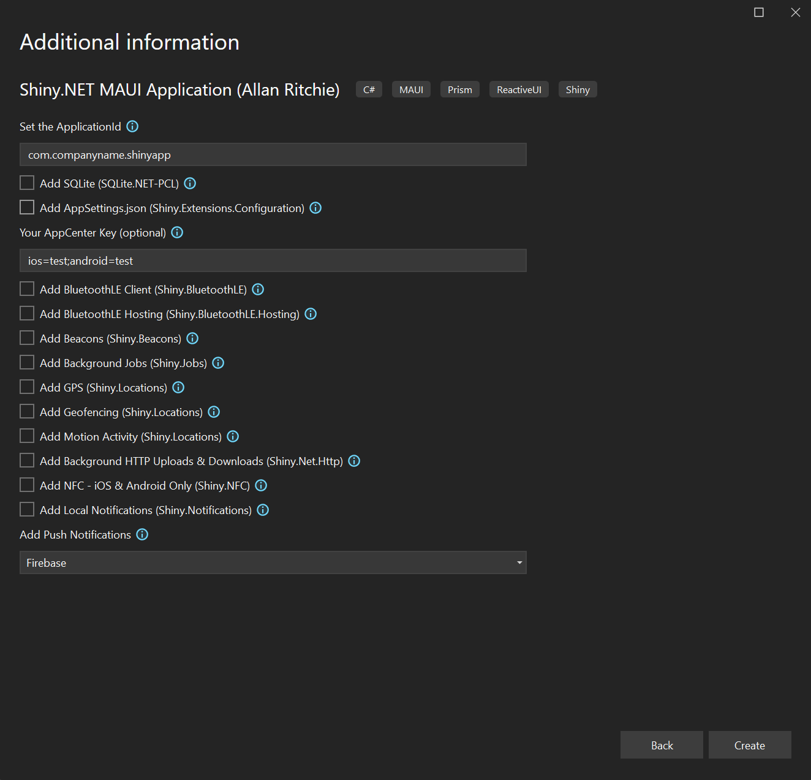

# Shiny Templates

## Intro
* Creates a best practice MAUI application with best-in-class frameworks:
    * [.NET MAUI](https://learn.microsoft.com/en-us/dotnet/maui/what-is-maui)
	* [Prism](https://prismlibrary.com/)
	* [ReactiveUI](https://reactiveui.net/)
	* [Shiny.NET](https://shinylib.net)

## Features
	* Entitlements for iOS/MacCatalyst if necessary (ie. NFC, Push)
	* Info.plist permissions for iOS/MacCatalyst
	* AndroidManifest.xml Permissions & Features for Android
	* Preps all of the necessary functionality for a SQLite Database	
	* All of your MauiProgram.cs Dependency Injection
	* Create AppSettings.json
	* Create & auto-configure a strongly-typed settings class that can be bound to preferences or secure storage
	* Create & auto-configure a startup service

---

* Other 3rd party libs

		<!--
				<PackageReference Include="UraniumUI.Material" Version="$(UraniumUIVersion)" />
		<PackageReference Include="UraniumUI.Icons.MaterialIcons" Version="$(UraniumUIVersion)" />
		<PackageReference Include="Prism.Maui.Rx" Version="$(PrismLibVersion)" />
		
		<PackageReference Include="CompiledBindings.MAUI" Version="1.0.13" />
		<PackageReference Include="Humanizer" Version="2.14.1" />
		<PackageReference Include="Plugin.Maui.Audio" Version="0.1.0-preview1" />
		<PackageReference Include="CommunityToolkit.Maui" Version="1.3.0" />
		
		<PackageReference Include="Sharpnado.Tabs" Version="3.0.0" />
		<PackageReference Include="AiForms.Maui.SettingsView" Version="0.1.10-pre" />
		<PackageReference Include="ZXing.Net.Maui" Version="0.1.0-preview.7" />
		<PackageReference Include="BarcodeScanner.Mobile.Maui" Version="6.3.0.23-pre" />
		-->

