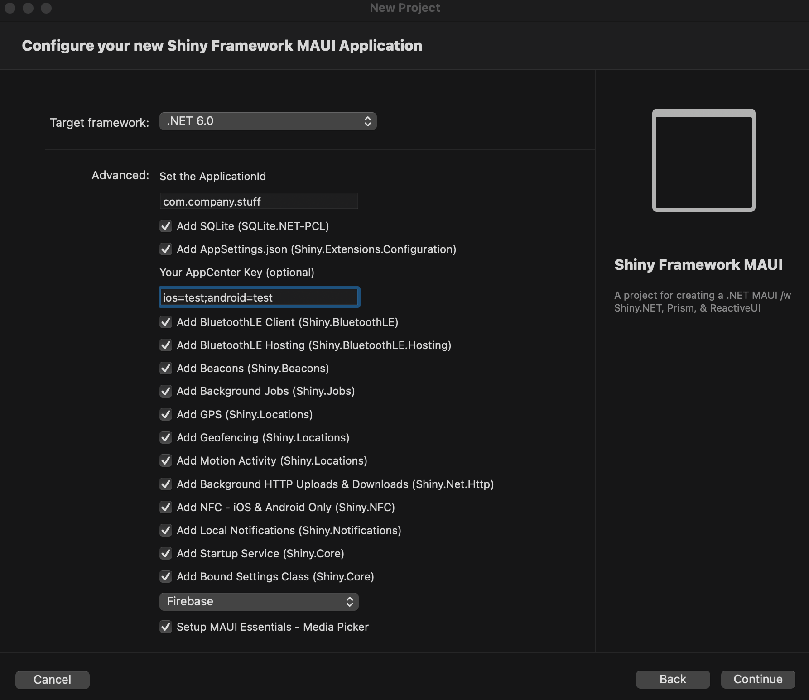

# Shiny Templates

## Intro
* Creates a best practice MAUI application with best-in-class frameworks:
    * [.NET MAUI](https://learn.microsoft.com/en-us/dotnet/maui/what-is-maui)
	* [Prism](https://prismlibrary.com/)
	* [ReactiveUI](https://reactiveui.net/)
	* [Shiny.NET](https://shinylib.net)

## Features
* Entitlements for iOS/MacCatalyst if necessary (ie. NFC, Push)
* Info.plist permissions for iOS/MacCatalyst
* AndroidManifest.xml Permissions & Features for Android
* Preps all of the necessary functionality for a SQLite Database	
* All of your MauiProgram.cs Dependency Injection
* Create AppSettings.json
* Create & auto-configure a strongly-typed settings class that can be bound to preferences or secure storage
* Create & auto-configure a startup service

---

