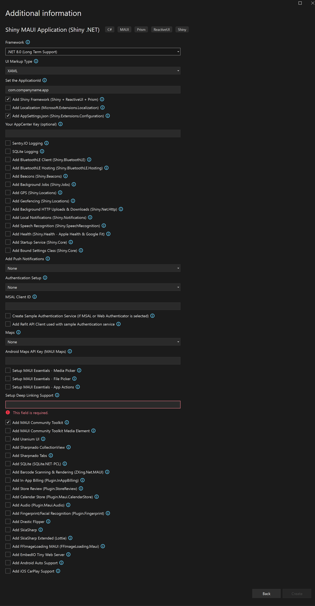

# Shiny Templates

**Please NOTE: Shiny v3 (used by these templates) & the templates are in a preview state.  Issues are anticipated.**

### To Install
> dotnet new --install Shiny.Templates

or update

> dotnet new --update-apply

## Intro
* Creates a best practice MAUI application with best-in-class frameworks:
    * [.NET MAUI](https://learn.microsoft.com/en-us/dotnet/maui/what-is-maui)
	* [Prism](https://prismlibrary.com/)
	* [ReactiveUI](https://reactiveui.net/)
	* [Shiny.NET](https://shinylib.net)

## Features
* Entitlements for iOS/MacCatalyst if necessary (ie. NFC, Push, MSAL)
* Info.plist permissions for iOS/MacCatalyst
* AndroidManifest.xml Permissions & Features for Android
* Preps all of the necessary functionality for a SQLite Database	
* All of your MauiProgram.cs Dependency Injection
* Setup AppCenter Logging
* Create AppSettings.json
* Create & auto-configure a strongly-typed settings class that can be bound to preferences or secure storage using Shiny
* Create & auto-configure a Shiny startup service
* Setup everything needed for the .NET MAUI Essentials Media Capture service
* Setup all of the necessary boilerplate for the following authentication providers:
	* MAUI Web Authentication
	* MSAL (Microsoft Authentication Library) Basic
	* MSAL (Microsoft Authentication Library) B2C
	* MSAL (Microsoft Authentication Library) Broker
* Full Setup for the following 3rd party components
	* [SQLite.NET-pcl](https://github.com/praeclarum/sqlite-net) by Frank Krueger
	* [ZXing.Net.Maui](https://github.com/Redth/ZXing.Net.Maui) by Jon Dick
	* [Store Review Plugin](https://github.com/jamesmontemagno/StoreReviewPlugin) by James Montemagno
	* [In-App Billing Plugin](https://github.com/jamesmontemagno/InAppBillingPlugin) by James Montemagno
	* [MAUI Audio Plugin](https://github.com/jfversluis/Plugin.Maui.Audio) by Gerald Versluis
	* [.NET MAUI Community Toolkit](https://learn.microsoft.com/en-us/dotnet/communitytoolkit/maui/)
	* [Fingerprint Plugin](https://github.com/smstuebe/xamarin-fingerprint) by Sven-Michael Stübe
---

